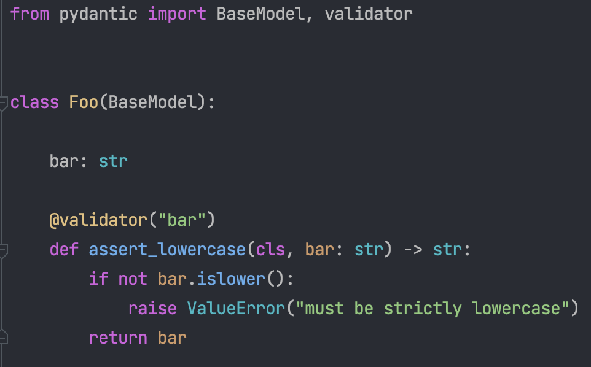

# Summary and Conclusion

## Summary
In this tutorial we have demonstrated how Pydantic can improve the user experience of scientific Python software. In this introductory tutorial we have covered:

- How to define a Pydantic model and adjust its configuration to disallow extra fields and enable strict validation
- We have seen an overview of the atomic types supported and an overview of the most common advanced types
- We have learned how to implement custom validators and how to use the `validate_arguments` decorator to validate function arguments
- We covered the serialisation of Pydantic models to JSON and YAML
- We applied the knowledge to an example application, where we requested weather data from the Open Meteo API. We represented the response as a Pydantic model and validated it.

This sets the foundation for using Pydantic in your own projects.

## Some General Thoughts
Pydantic is not meant to introduce static typing to Python "through the backdoor". So it may not make sense to use it for every small script, that you only use for yourself or share with a few colleagues. However, if you are writing a larger application, that is used by many people, or an application that is re-used with many different inout configurations, Pydantic will be a great tool to improve the safety of use and user experience of your application. Personally we think Pydantic should be used where the type conversion and validation brings the most value. 

As we listed in the title of this tutorial, we consider the most important use cases of Pydantic to be:

- **Data Structures**: Pydantic is a great tool to define and validate data structures. Pydantic was developed for representation of web data, and this is its biggest strength. Large hierarchical datasets, represented e.g. in JSON can be read from disk and validated. This makes sure any application runs with validated data and does not fail at a later stage. More generally this is useful for the representation and validation of meta data. Many scientific data formats support associated meta data for the actual (binary) data, such as FITS, HDF5, ASDF, etc. 

- **Configuration**: Pydantic is a great tool to define and validate the structure of configuration files. This is especially true for larger applications, where the configuration is complex and the user is not familiar with the application. Pydantic can help to avoid typos and other mistakes in the configuration file. It can also help to avoid the need to read the documentation to understand the configuration file, especially the configuration includes deafult values. It is also a way to programmatically define JSON schemas and fields. Which might be easier to maintain than a JSON schema file.

- **APIs**: Pydantic is a great tool to define APIs where user interaction is important. One can use Pydantic to validate function arguments and class attributes. This is especialy useful for APIs, that are used in an interactive context such as a Jupyter notebooks or IPython environments.

## Conclusion and Additional Thoughts

### Editor Plugins

Pydantic introduces some specific functionality, which is not supported by all editors out of the box. This includes for example the `validator` decorator, which is used to define a class method, but not recognized as such by all editors.
However, there are plugins available for most editors, which add support for Pydantic.

Let's dive deeper into the above example of the `validator` decorator. If we use base PyCharm as our IDE, we will get a yellow squiggly line under the `cls` parameter as shown in the screen show below:

This is because the `validator` decorator converts the instance method to a class method, but PyCharm still thinks the method is an instance method whose first parameter should be `self`. You can see in this warning message in the screenshot as I have hovered over the yellow squiggly lines. If I then install the Pydantic plugin for PyCharm, you will see that the method is now correctly recognized as a class method and the yellow squiggly line goes away:

This is just one quality of life improvement from the Pydantic plugin, but the plugin contains many others.

## A Note On Pydantic v2.0

On June 30th 2023 Pydantic v2.0 was released. It was a bit to short notice to include it in this tutorial. However, it is a major release and it is worth mentioning it here. Pydantiv v2.0 inlcudes a major refactoring of the actual validation code, which is now fully implemented in Rust and exposed to Python, which makes Pydantic much faster. This can be relevant e.g. for large data sets.

It is supposed to be mostly backwards compatible. However, there are some changes that might break existing code. The most important changes affecting things learned in this tutorial are:

API changes to the `BaseModel` class:

Some of the decorators have been renamed:

- `@validate_arguments` has been renamed to `@validate_call`
- `@root_validator` has been deprecated, and should be replaced with `@model_validator`.
- `@validator` has been deprecated, and should be replaced with `@field_validator`.

Under the following links you can find some more details on Pydantic v2.0:

- Blog post: https://docs.pydantic.dev/2.0/blog/pydantic-v2-final/
- Migration guide: https://docs.pydantic.dev/2.0/migration/
- https://github.com/pydantic/pydantic/releases/tag/v2.0

We hope you enjoyed this tutorial and learned something new. If you have any questions or comments, please feel free to contact us.

